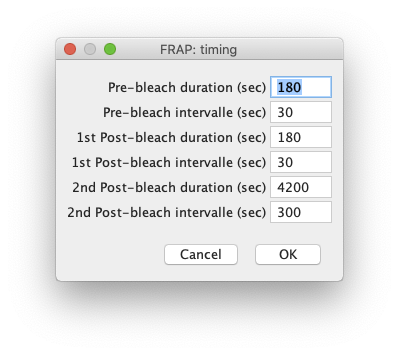
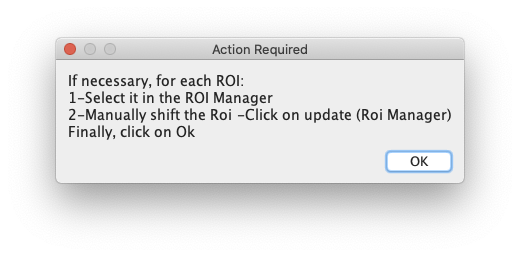
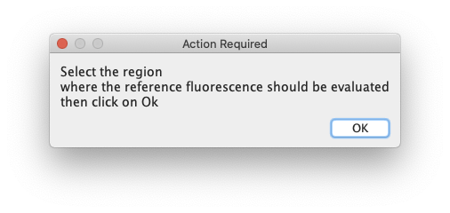
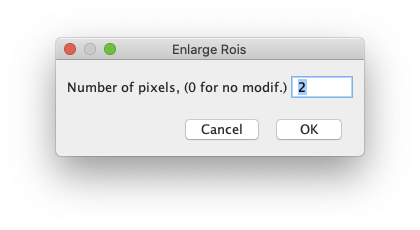

# Simple FRAP data extraction from Metamorph datasets using ImageJ 

## What does it do ?
*This macro is aimed at basic data extraction/correction/normalisation from FRAP datasets acquired using the Metamorph software*

## How to install/use the macro ?

### Requirements:

This macro expects the user to have:

* The two following plugins installed:
	* The [Metamorph Companion suite](https://github.com/fabricecordelieres/IJ-Plugin_Metamorph-Companion) 
	* The [StackReg plugin](http://bigwww.epfl.ch/thevenaz/stackreg/) from the BIG Group at EPFL
* A dataset opened as a hyperstack.
* A file containg the outlines of all FRAPed regions of interest. This file should be saved as a Metamorph rgn file.

**_Alternatively, this repository contains an example dataset that may be used to test the workflow. It has been acquired by Xiaomin Zhang at the [Bordeaux Imaging Centre](http://www.bic.u-bordeaux.fr/)._**

### Using the macro
1. Make sure your ImageJ is up-to-date: go to Help/Update and make sure you are running the latest version.
2. Drag-and-drop the macro file to ImageJ's toolbar: a new window containg the code of the macro should appear.
3. Open the dataset to analyse. You could either:
	1. Open all files of the serie as a hyperstack using File/Import/Image Sequence.
	2. Use the File/Import/Metamorph nd file and point at the relevant nd file within the acquisition folder.
	3. Use the BioFormat plugin.
4. Run the macro by using the Macro/Run command, within the Macro Editor window.
5. Follow the on-screen instructions. 

## How does it do it ?
### Generating the time stamps
Through the graphical user interface, durations for the pre-bleach, first post-bleach period and second post-bleach period are asked. The corresponding time intervalles are also requested and stored. Based on user provided data, the timestamps for each timepoint are calculated.

### Pre-processing
Pre-procesing is performed through three steps:

1. The user is asked to point at the Metamorph region file containing the locations of bleached areas. A pop-up window will propose to re-adjust manually the ROIs so that they fit onto the structures of interest.

2. Two additionnal ROIs are needed, which the user will have to draw:
	1. A first reference ROI, where the fluorescence is not supposed to have been perturbed by the FRAP experiment or to have moved during the process. It will be used to estimate and compensate for the observationnal photobleaching.
	2. A second reference ROI where the background/non specific signal will be estimated and used to get a "background free" signal.

	
3. Due to possible mis-targetting of the FRAP system and/or slight sample displacements during the acquisition, the ROIs might not encompass the full signal all the way through the experiment. Therefore, the user is asked wheither a ROI dilation should be performed: the extend of dilation might be defined using a pop-up dialog box.

4. Finally, to compensate for potential drift during the acquisition, image registration is performed using the [StackReg plugin](http://bigwww.epfl.ch/thevenaz/stackreg/) and its "Rigid Body" algorithm.

### Data extraction

1. The ROIs areas are determined and stored: this will be usefull when dealing with background  subtraction and normalisation, as the FRAPed ROI might have a different area as compared to the reference ROIs.
2. The previsously computed timestamps are logged into a Results Table under column "Time_(sec)".
3. The total intensity is extracted from each ROI (including the two reference ROIs), for each timepoint. The value is logged into the Results Table, columns being named after the ROIs, one timepoint value per row.
4. Background correction is performed by first scaling the total intensity of the background ROI to the area of the ROI to be corrected, then subtrating it to the total intensity of the considered ROI. Results are stored in a new column, named after the original ROI, to which is appended the "-bkgd-corr" suffix.
5. Bleaching correction is performed by making the ratio between the background corrected intensity of the ROI and the background corrected intensity of the reference ROI. Results are stored in a new column, named after the original ROI, to which is appended the "-bkgd-corr_bleach-corr" suffix.
6. Normalization is performed by dividing the background and bleach corrected at any time within the serie by the value obtained at for the first timepoint.
7. Finally, a plot is generated presenting for all ROIs the corrected normalised values as a function of time.
